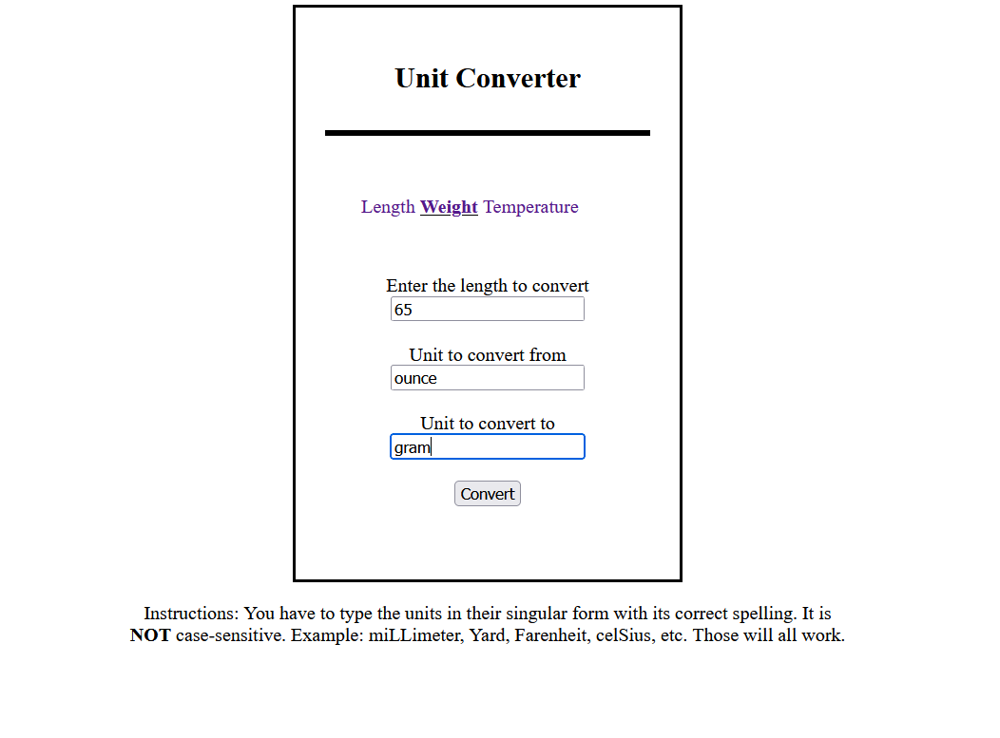
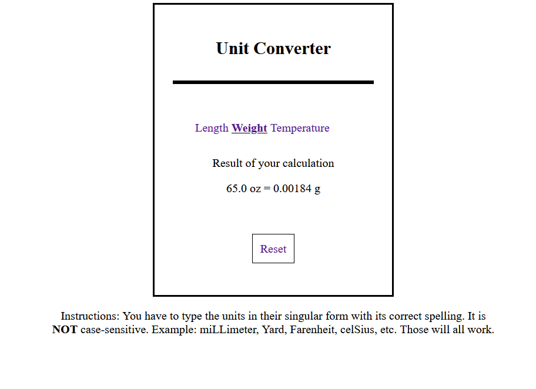
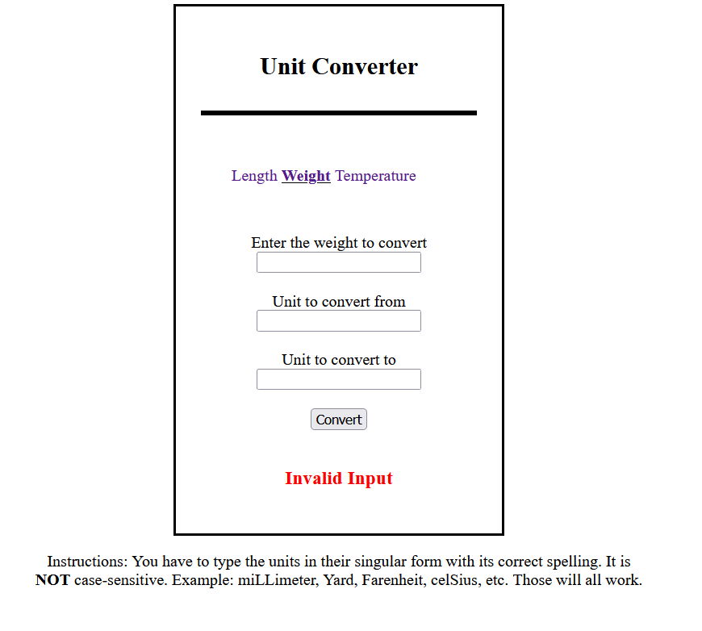

# unit-converter

Good day everyone, this is my take on the [unit converter](https://roadmap.sh/projects/unit-converter)
project from [roadmap.sh](https://roadmap.sh). This unit converter doesn't cover that much
units neither does it cover all types of measurements. I used regular Spring MVC for this
one. As for my template engine, I used Thymeleaf (not very proficient with it). Apologies in
advance for the horrendous HTML code and I just realized I misspelled Fahrenheit 
as "Farenheit" in my code...

## Features
- Covers three different types of measurements; length, weight, and temperature.
- For length, there is: millimeter, centimeter, meter, kilometer, inch, foot, yard, and mile.
- For weight, there is: milligram, gram, kilogram, ounce, and pound.
- For temperature there is: Celsius, Fahrenheit, and Kelvin.
- The app tells you if your input is invalid.
- Uses HTML form to send the parameters.
- Instruction is provided below the form box for proper format of inputs.
- The converted value will have at most 5 decimal places.

## Installation
1. Clone the GitHub repo and open your terminal in the project folder:
```shell
git clone https://github.com/raafiAbdul/unit-converter.git
cd unit-converter
```
2. Then in the terminal, type this to run app:
```shell
.\mvnw.cmd sprint-boot:run
```
Or in mac/linux:
```shell
./mvnw spring-boot:run
```
3. To close the app, in terminal, simply click ```Ctrl + C```.

## Usage
1. Type in your inputs: 
2. And be presented with the following screen 
3. In case of any invalid input, you are notified as such 
